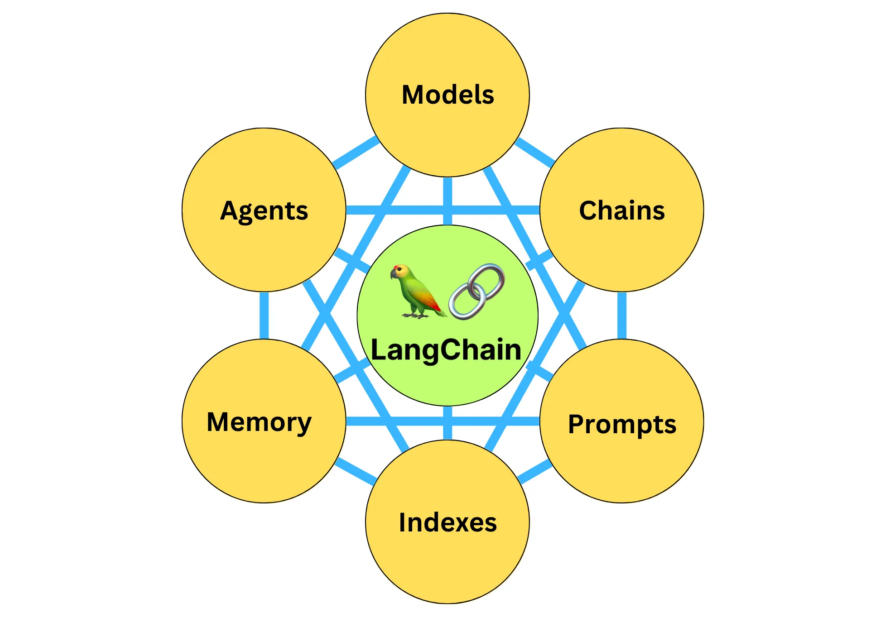

#### 【说明】

***

LangChain 知识点

#### 【一】组件

***

  

##### 【1.1】Model

***

> 模型：主要是指 LLMs 的 LangChain 接口和调用细节，以及输出解析机制

##### 【1.2】Chain

***

> 链：LangChain 中的核心机制，以特定方式封装各种功能，通过一系列的组合，灵活完成常见用例

##### 【1.3】Prompt

***

> 提示模板：提示工程流线化，进一步激发 LLMs 的潜力

##### 【1.4】Index

***

> 数据检索：构建并操作文档的方法，接受用户的查询并返回最相关的文档，搭建本地知识库

##### 【1.5】Memory

***

> 记忆：让 LLMs 拥有短时记忆和长时记忆，在对话过程中存储和检索数据

##### 【1.6】Agent

***

> 代理：LangChain 中的核心机制，让大模型自主调用外部工具和内部工具，自主完成任务